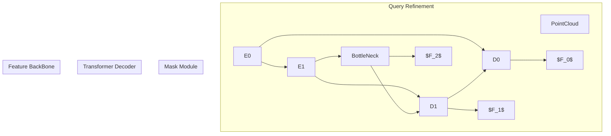

----------------------------

```d2
plankton -> formula: will steal  
formula: {  
  equation: |tex  
    \\lim_{h \\rightarrow 0 } \\frac{f(x+h)-f(x)}{h}  
  |  
}

```


- (d2 나 mermaid 같은 마크다운은 이런 피규어 그리는데 쓰기 힘든 것 같다)
- (mermaid는 tex가 지원이 안되고, d2는 지원되긴 하는데 obsidian이나 quartz에서 기본적용이 안되어있음)
- 어느쪽이든 다이어그램 속 요소들 위치 설정이 어렵다
- 다이어그램이나 피규어 그리는 방법은 좀 더 찾아보자
--------

### 목적
- Mask3D의 논문을 읽고 코드를 분석한 후 내용을 정리한다.

### Background
#### 3D Instance Segmentation
- 3D Instance Segmentation의 목표는 전체 scene의 pointcloud $P \in \mathbb{R}^{N \times 6}$  의 모든 원소 $p$  에 대해,  같은 instance 에 속하는 $p$ 들을 그룹화하고, 해당 instance segmentation의 class를 추정하는 것이다.
- K 개의 instance를 탐지했을 경우 개개의 instance에 해당하는 mask $B \in \mathbb{R}^{N \times K}$ 와 해당 mask 가 represent하는 object (instance) 의 class를 출력한다.
-  scene 속에서 object를 찾는다는 점에서 object detection과, 모든 $p$ 에 대해 $p$ 가 어떤  instance인지 분류를 수행해야 한다는 점에서 classification과 유사하다.


####  Mask3D 이전의 연구들
- Mask3D 의 related works 부분에 따르면 
- 기존 연구들 중에는 instance mask 를 바로 구하는 end-to-end 방식이 드물고, 
	- bottom-up, top-down, voting 방식 등이 있다.
		- bottom-up
		- top-down
		- voting
- predicted instance mask 와 annotated instance mask 사이에서 Loss 를 계산할 때 고려해야 할 부분이 있다.
	- Dataset의  annotated mask와 predicted mask를 비교해서 Loss를 계산해야 하는데, predicted mask 속 어떤 mask가 어느 annotated mask에 해당하는 것인지 알기 어렵다.
	- Bipartite matching 알고리즘인 Hungarian Matching을 이용해 predicted mask 와 mask annotation 속 각 instance mask를 제대로 매칭하는 방법을 제시했다. 
		- Bipartite matching은 크기가 같고 서로 disjoint인 두 집합에 대해 한 집합의 원소와 다른 집합의 원소끼리 1:1 mapping 을 하는 것이다. Loss를 계산할 때 우선 predicted masks 와 annotated masks 간의 bipartite matching을 수행하고, predicted mask의 Loss를 계산한다.
	- 저자들도 이 방식을 그대로 이용한다.

### 전체적인 아이디어

- 일단 PointCloud Data를 Voxel로 변환한다.
	- Scene의 Voxel grid에서 값이 있는 부분은 Sparse하기 때문에 Point가 있는 부분의 Voxel값만 추출한다. 해당 Voxel의 RGB값은 그 속에 있는 Point의 RGB값의 평균이다.
- 3D-UNet으로 Voxel 에 대한 Feature를 여러 scale로 출력한다.
	- UNet 특성상 여러 scale 의 Feature를 출력할 수 있다. 
- Transformer decoder로 여러 scale의 Feature 와 cross attention을 수행하며 instance mask와 class probability를 출력하도록 학습시킨다.
- instance query라는 것이 있다.
- instance query를 MLP인 $f_{mask}()$로 decode 해서 instance feature를 얻을 수 있고, 또 다른 MLP인 $f_{class}()$ 로 decode해서 class probability를 출력할 수 있다. 
	- instance feature 와 point feature $F_0$  
- instance query는 refinement
	- instance query는 특정 instance 를 represent한다.
- 

- sparse 3D U-Net base의 Feature BackBone를 이용해


- Transformer Decoder를 이용해서 instance mask를 얻는다.


- Point Cloud 를 대상으로 함. Point Cloud 를 sparse한 voxel로 변환한 후 처리함.
- 처음으로 3D instance segmentation 분야에서 transformer를 이용해 SOTA를 달성함
	- instance queries 라는 것이 있음. 각 query는 scene 속 하나의 instance를  표현함. 이 instance query를 decode해서 instance feature도 얻고, 그 instance의 class label도 추정함.
- 기존 주류 연구들이 voting, clustering 등 거추장스러운 과정을 통해 instance mask를 얻는 것과 다르게 instance mask를 end-to-end 로 출력함.
	- Mask Module 이 instance mask prediction과 classification을 수행한다.
		- instance query와 point feature를 입력받음.
		- MLP를 통해 instance query를 instance feature로 decode하고, 이를 point feature 와 dot product를 시킴. 여기에 sigmoid를 취하면 heatmap이 됨 (instance query가 represent하는 instance의 heatmap)
		- heatmap을 0.5로 threashold를 취하면 instance mask를 얻음.
- instance mask를 predict했으면 이를 annotated mask 와 비교해 loss를 얻어야 한다. 이때 [[Hungarian Matching]] 을 이용한다.
-  Sparse Convolutional Feature Backbone Network
	- raw Pointcloud $P \in \mathbb{R}^{N \times 6}$  를 voxel $V \in \mathbb{R}^{M_0 \times 3}$ 로 변환함. 공간상의 모든 grid에서 voxel값을 구하는 것이 아님. 공간이 sparse 하기 때문에 몇개의 voxel만 계산함. 이때 voxel의 색은 그 안의 point들의 색의 평균임.
	- MinkowskiEngine 라이브러리의 (sparse한 3차원 공간 데이터를 처리할 때 주로 씀) UNet backbone을 이용해 다양한 스케일에서 feature를 구함.
	- $r \geq 0$ 인 $r$ 에 대해 $F_0 \in \mathbb{R}^{M_0 \times D}$ (full scale), $F_1 \in \mathbb{R}^{M_1 \times D}$ , ... 의 다양한 스케일의 피쳐맵 $F_{r}$ 를 출력한다.
	-  